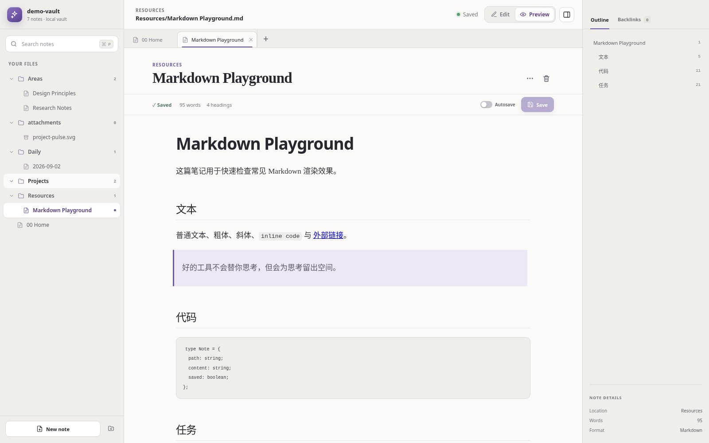

# Obsidian Web Gateway

**English** | [简体中文](README.zh-CN.md)



*The interface is shown with fictional Vault content.*

Obsidian Web Gateway (OWG) is a small local daemon that gives an existing Obsidian Vault a secure browser UI. The Vault remains an ordinary directory of Markdown files and is always the source of truth.

OWG is not an Obsidian replacement, sync service, hosted SaaS product, plugin runtime, or collaborative editor. It does not upload notes or collect telemetry.

> Back up your Vault before using write features for the first time. Atomic writes and revision checks reduce risk, but they are not a backup system.

## Downloads

Each [GitHub Release](https://github.com/zhangchaosd/obsidian-web-gateway/releases) contains a standalone executable with the web UI embedded. Node.js is not required at runtime.

| Platform | x64 | ARM64 |
| --- | --- | --- |
| Linux | `linux-x86_64` | `linux-aarch64` |
| macOS | `macos-x86_64` | `macos-aarch64` |
| Windows | `windows-x86_64` | `windows-aarch64` |

Verify downloads against `SHA256SUMS.txt` from the same release.

## Quick start

Build the frontend once, then run the Rust server:

```bash
cd web
npm ci
npm run build
cd ..
OBSIDIAN_WEB_PASSWORD='choose-a-long-password' cargo run --release -- \
  --vault ./demo-vault \
  --listen 127.0.0.1:8765
```

Open <http://127.0.0.1:8765>. A release binary includes the frontend and does not require Node.js.

Authentication is enabled by default. Set `OBSIDIAN_WEB_PASSWORD` or pass `--password`. `--no-auth` is intended only for trusted localhost use. OWG never writes the password to a config file.

## CLI

```text
obsidian-web --vault <PATH>
  --listen <IP:PORT>       default: 127.0.0.1:8765
  --config <PATH>          TOML configuration
  --log-level <LEVEL>      default: info
  --read-only              enforce read-only mode server-side
  --show-hidden-files      show non-reserved dotfiles
  --password <PASSWORD>    preferably use OBSIDIAN_WEB_PASSWORD
  --no-auth                disable login
  --secure-cookie          mark session cookies Secure behind HTTPS
  --trusted-proxy <CIDR>   trust X-Forwarded-For only from this proxy; repeatable
```

The server listens only on loopback by default. LAN/public binding must be explicit.

## Configuration

CLI values take precedence over `OBSIDIAN_WEB_*` environment variables, then TOML, then defaults.

```toml
[vault]
path = "/Users/user/Documents/MyVault"

[server]
listen = "127.0.0.1:8765"
trusted_proxies = ["127.0.0.1/32", "::1/128"]

[auth]
enabled = true
secure_cookie = false

[features]
read_only = false
show_hidden_files = false

[logging]
level = "info"
```

Supported environment variables are `OBSIDIAN_WEB_VAULT`, `OBSIDIAN_WEB_LISTEN`, `OBSIDIAN_WEB_PASSWORD`, `OBSIDIAN_WEB_AUTH_ENABLED`, `OBSIDIAN_WEB_READ_ONLY`, `OBSIDIAN_WEB_LOG_LEVEL`, and `OBSIDIAN_WEB_TRUSTED_PROXIES` (comma-separated IPs or CIDRs).

## Features

- Explicit multi-tab workspace: sidebar navigation replaces the current tab, while `+` deliberately opens a new one
- One note per tab across files, search results, Wiki Links, and Backlinks, avoiding duplicate editors and stale copies
- CodeMirror Markdown editing, polished reading mode, autosave, line controls, word counts, Outline, and Backlinks
- Full-text search, Wiki Link resolution, image embeds, task lists, tables, and sanitized preview HTML
- Create, rename, move, and recoverably delete files and folders, including drag-and-drop file moves
- External-change notifications, SHA-256 revision conflicts, side-by-side comparison, and explicit overwrite recovery
- Responsive desktop/mobile workspace, light/dark color schemes, keyboard shortcuts, and accessible dialogs
- Argon2 login, CSRF protection, per-client throttling behind explicitly trusted Caddy/reverse proxies, and server-enforced read-only mode

## Demo vault

The repository includes [`demo-vault`](demo-vault) with fictional projects, research, daily notes, Wiki Links, tasks, tables, and a local SVG attachment. It is safe for UI evaluation and automated screenshots. To run it without authentication, keep the listener on localhost:

```bash
cargo run -- --vault ./demo-vault --listen 127.0.0.1:8765 --no-auth
```

Do not use `--no-auth` when the service is reachable through a reverse proxy or any untrusted network.

## Security

Every filesystem operation goes through a common Vault sandbox. It rejects absolute paths, encoded traversal, Windows traversal syntax, reserved directories (`.git`, `.obsidian`, `.trash`), and symlink components. Markdown is limited to UTF-8 and 10 MiB. SVG responses receive a restrictive sandbox CSP so they remain viewable as images without executing active content.

Password login uses Argon2, random in-memory sessions, HttpOnly `SameSite=Strict` cookies, login throttling, and a CSRF token for every mutation. Sessions disappear when the process restarts. The UI sanitizes preview HTML, while the server sets CSP, `nosniff`, frame, and referrer protections. CORS is not enabled.

Use `--secure-cookie` when the browser-facing origin is HTTPS. Do not expose a plain-HTTP OWG listener to an untrusted network.

## Reverse proxy

OWG does not manage TLS. A minimal Caddy setup on the same host is:

```caddyfile
notes.example.com {
  reverse_proxy 127.0.0.1:8765
}
```

Run OWG with the local Caddy address as an explicitly trusted proxy:

```bash
OBSIDIAN_WEB_PASSWORD='choose-a-long-password' ./obsidian-web \
  --vault /path/to/MyVault \
  --listen 127.0.0.1:8765 \
  --secure-cookie \
  --trusted-proxy 127.0.0.1/32
```

Caddy sets `X-Forwarded-For` for upstream requests. OWG uses it for per-client login throttling only when the TCP peer matches a configured trusted proxy, and parses proxy chains from right to left. Requests from any other peer ignore forwarding headers. Never configure `0.0.0.0/0` or `::/0` as a trusted proxy; doing so would allow clients that can reach OWG directly to spoof their rate-limit identity.

Keep OWG bound to `127.0.0.1`. If Caddy connects over IPv6 loopback, also add `--trusted-proxy ::1/128`. For a proxy on another machine, trust only its exact private address or narrow network and use a private tunnel such as WireGuard or Tailscale.

## Development

Requirements: Rust 1.88+, Node.js 22+, and npm.

```bash
cargo fmt --check
cargo clippy --workspace --all-targets -- -D warnings
cargo test --workspace

cd web
npm run typecheck
npm test
npm run build
npx playwright install chromium
npm run test:e2e
```

`scripts/build.sh` builds the web bundle before the release binary. On Windows, use `scripts/build.ps1`.

## Testing

Rust tests cover sandbox traversal, platform-style paths, symlink escape, authentication/CSRF, trusted-proxy client identity, parser behavior, read-only enforcement, atomic replacement, watcher refresh, and revision conflicts. Frontend tests cover Markdown XSS sanitization, GFM task lists, Wiki Links, embeds, and code-span handling. Playwright exercises tabs, draft protection, drag-and-drop moves, embedded assets, and responsive navigation in desktop and mobile Chromium profiles.

For manual acceptance, copy a real Vault (do not start with the only copy), run OWG, edit the same note in Obsidian Desktop and the browser, and verify the browser reports external modifications rather than overwriting them.

## Data safety and backups

Writes use a complete temporary file in the destination directory, flush and sync it, then replace the original. Saves include a SHA-256 base revision; stale saves receive HTTP 409. Deletes move entries into `Vault/.trash` and never permanently delete through the API.

Recommended independent backups include Git, Time Machine, Windows File History, NAS snapshots, and ZFS/Btrfs snapshots.

## Known limitations

- Authentication and sessions are process-local; there is no account or recovery system.
- The in-memory index is rebuilt after filesystem batches and is not persisted.
- Renaming a note does not rewrite Wiki Links in other notes.
- Wiki Link resolution intentionally reports ambiguity rather than guessing.
- Markdown is UTF-8 only, the editable limit is 10 MiB, and attachment upload is not included.
- Obsidian plugins, Canvas, Dataview, Excalidraw, CRDT collaboration, Mermaid, PWA, and Graph View are outside this MVP.
- Filesystem replacement semantics depend on the platform. A failed replacement leaves the original intact and returns an error.

## Privacy

There is no telemetry, analytics, cloud service, or external API call. Note contents are neither logged nor stored outside the Vault.

## Automated builds and releases

Every push and pull request runs the Rust, TypeScript, frontend, and browser test suites, then builds artifacts for Linux, macOS, and Windows on both x64 and ARM64. Pushing a `v*` tag creates a GitHub Release with six platform archives and `SHA256SUMS.txt`.

## License

Licensed under the permissive [MIT License](LICENSE).
